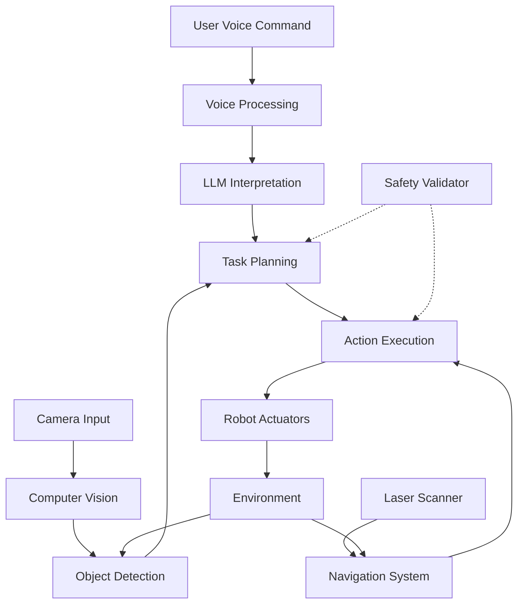

# Capstone Project - Autonomous Humanoid Assistant

## Overview

The capstone project integrates all the concepts learned throughout the Vision-Language-Action (VLA) module to create a complete autonomous humanoid assistant. This project combines voice command processing, language model integration, computer vision, and robot control to build a system that can understand natural language commands and execute complex tasks in real-world environments.

## Learning Objectives

- Integrate multiple AI and robotics components into a cohesive system
- Design system architecture for real-time processing and response
- Implement safety and validation mechanisms for autonomous operation
- Create user-friendly interfaces for human-robot interaction
- Test and validate the complete system in realistic scenarios

## System Architecture

The autonomous humanoid assistant consists of multiple interconnected subsystems:

1. **Perception System**: Processes voice, visual, and sensor data
2. **Cognition System**: Interprets commands and plans actions using LLMs
3. **Action System**: Executes robot movements and manipulations
4. **Interaction System**: Manages human-robot communication
5. **Safety System**: Monitors and validates all actions for safety



## Implementation Requirements

### Core System Components

```python
import rclpy
from rclpy.node import Node
from std_msgs.msg import String
from sensor_msgs.msg import Image, LaserScan
from geometry_msgs.msg import Twist, Pose
from openai import OpenAI
import json
import speech_recognition as sr
import threading
import queue
import time
from enum import Enum
from typing import Dict, List, Optional, Tuple

class SystemState(Enum):
    IDLE = "idle"
    LISTENING = "listening"
    PROCESSING = "processing"
    PLANNING = "planning"
    EXECUTING = "executing"
    ERROR = "error"
    SAFETY_LOCKOUT = "safety_lockout"

class AutonomousAssistant(Node):
    def __init__(self):
        super().__init__('autonomous_assistant')

        # Initialize subsystems
        self.initialize_perception_system()
        self.initialize_cognition_system()
        self.initialize_action_system()
        self.initialize_interaction_system()
        self.initialize_safety_system()

        # Publishers
        self.cmd_vel_pub = self.create_publisher(Twist, 'cmd_vel', 10)
        self.speech_pub = self.create_publisher(String, 'tts_commands', 10)
        self.gesture_pub = self.create_publisher(String, 'gesture_commands', 10)
        self.status_pub = self.create_publisher(String, 'system_status', 10)

        # Subscribers
        self.voice_cmd_sub = self.create_subscription(
            String, 'voice_commands', self.voice_command_callback, 10
        )
        self.camera_sub = self.create_subscription(
            Image, 'camera/rgb/image_raw', self.camera_callback, 10
        )
        self.laser_sub = self.create_subscription(
            LaserScan, 'scan', self.laser_callback, 10
        )

        # System state
        self.current_state = SystemState.IDLE
        self.current_task = None
        self.task_queue = queue.Queue()
        self.system_status = {
            'battery_level': 100.0,
            'memory_usage': 0.0,
            'cpu_usage': 0.0,
            'last_command_time': time.time()
        }

        # Start system monitoring
        self.monitor_timer = self.create_timer(1.0, self.system_monitor)

        # Start task execution loop
        self.execution_timer = self.create_timer(0.1, self.execute_current_task)

        self.get_logger().info('Autonomous Assistant Node Initialized')

    def initialize_perception_system(self):
        """Initialize the perception system for voice, vision, and sensors"""
        # Voice recognition setup
        self.recognizer = sr.Recognizer()
        self.microphone = sr.Microphone()
        self.recognizer.energy_threshold = 300

        # Object tracking
        self.detected_objects = {}
        self.object_history = []

    def initialize_cognition_system(self):
        """Initialize the LLM-based cognition system"""
        self.client = OpenAI()  # Assumes API key is configured
        self.conversation_context = []
        self.task_planner = TaskPlanner(self.client)

    def initialize_action_system(self):
        """Initialize the action execution system"""
        self.action_executor = ActionExecutor(self)
        self.navigation_system = NavigationSystem(self)

    def initialize_interaction_system(self):
        """Initialize the human-robot interaction system"""
        self.interaction_manager = InteractionManager(self)

    def initialize_safety_system(self):
        """Initialize the safety monitoring system"""
        self.safety_validator = SafetyValidator()
        self.emergency_stop = False

    def voice_command_callback(self, msg):
        """Process incoming voice commands"""
        if self.current_state == SystemState.SAFETY_LOCKOUT:
            return  # Don't accept commands in safety lockout

        try:
            command_data = json.loads(msg.data)
            transcription = command_data.get('transcription', '')
            confidence = command_data.get('confidence', 0.0)

            if confidence > 0.6:  # Only process confident transcriptions
                self.process_voice_command(transcription)
        except json.JSONDecodeError:
            self.get_logger().warn("Invalid voice command format")
            return

    def process_voice_command(self, command: str):
        """Process a voice command through the full system pipeline"""
        self.current_state = SystemState.PROCESSING

        # Add to conversation context
        self.conversation_context.append({
            'role': 'user',
            'content': command,
            'timestamp': time.time()
        })

        # Use LLM to interpret command and generate task plan
        try:
            task_plan = self.task_planner.generate_task_plan(
                command,
                self.get_environment_context()
            )

            if task_plan:
                # Validate the plan for safety
                is_safe, reason = self.safety_validator.validate_task_plan(task_plan)
                if is_safe:
                    # Add tasks to execution queue
                    for task in task_plan:
                        self.task_queue.put(task)

                    self.current_state = SystemState.PLANNING
                    self.get_logger().info(f"Generated and validated task plan with {len(task_plan)} steps")
                else:
                    self.get_logger().warn(f"Unsafe task plan rejected: {reason}")
                    self.interaction_manager.speak(f"I cannot perform that task because it might be unsafe: {reason}")
                    self.current_state = SystemState.IDLE
            else:
                self.get_logger().warn("Could not generate task plan for command")
                self.interaction_manager.speak("I didn't understand your command. Could you please rephrase it?")
                self.current_state = SystemState.IDLE

        except Exception as e:
            self.get_logger().error(f"Error processing voice command: {e}")
            self.interaction_manager.speak("I encountered an error processing your command. Please try again.")
            self.current_state = SystemState.ERROR

    def get_environment_context(self) -> Dict:
        """Get current environment context for LLM reasoning"""
        return {
            'detected_objects': list(self.detected_objects.keys()),
            'robot_pose': self.get_robot_pose(),
            'battery_level': self.system_status['battery_level'],
            'safe_zones': ['charging_station', 'avoid_area_1', 'avoid_area_2']
        }

    def camera_callback(self, msg):
        """Process camera input for computer vision"""
        # In a real implementation, this would run object detection
        # For this example, we'll simulate object detection
        self.detect_objects_in_frame(msg)

    def laser_callback(self, msg):
        """Process laser scan data for navigation and safety"""
        # Update navigation system with obstacle information
        self.navigation_system.update_obstacles(msg.ranges)

    def execute_current_task(self):
        """Execute the current task in the queue"""
        if not self.task_queue.empty() and self.current_state != SystemState.EXECUTING:
            try:
                self.current_task = self.task_queue.get_nowait()
                self.current_state = SystemState.EXECUTING

                # Execute the task
                success = self.action_executor.execute_task(self.current_task)

                if success:
                    self.get_logger().info(f"Successfully completed task: {self.current_task['action']}")
                else:
                    self.get_logger().error(f"Failed to complete task: {self.current_task['action']}")
                    # Add error recovery logic here

                self.current_state = SystemState.IDLE
                self.current_task = None

            except queue.Empty:
                pass  # Queue was empty, no task to execute
            except Exception as e:
                self.get_logger().error(f"Error executing task: {e}")
                self.current_state = SystemState.ERROR

    def system_monitor(self):
        """Monitor system health and update status"""
        # Update system status
        self.system_status['last_command_time'] = time.time()

        # Check battery level (simulate drain)
        self.system_status['battery_level'] = max(0.0, self.system_status['battery_level'] - 0.01)

        # Check for safety conditions
        if self.system_status['battery_level'] < 10.0:
            self.initiate_battery_safety_procedure()

        # Publish system status
        status_msg = String()
        status_msg.data = json.dumps(self.system_status)
        self.status_pub.publish(status_msg)

    def initiate_battery_safety_procedure(self):
        """Handle low battery situation"""
        self.get_logger().warn("Battery level critically low, returning to charging station")
        self.interaction_manager.speak("Battery level critically low. Returning to charging station.")

        # Add return to charging station task
        charging_task = {
            'action': 'navigate_to',
            'parameters': {'location': 'charging_station'},
            'priority': 'high'
        }
        self.task_queue.put(charging_task)

class TaskPlanner:
    def __init__(self, client):
        self.client = client

    def generate_task_plan(self, user_command: str, environment_context: Dict) -> Optional[List[Dict]]:
        """Generate a detailed task plan using LLM"""
        prompt = f"""
        Given the user command and environment context, create a detailed task plan.

        User Command: {user_command}

        Environment Context:
        - Detected Objects: {environment_context.get('detected_objects', [])}
        - Robot Pose: {environment_context.get('robot_pose', 'unknown')}
        - Battery Level: {environment_context.get('battery_level', 100)}%
        - Safe Zones: {environment_context.get('safe_zones', [])}

        Create a task plan as a JSON array with steps. Each step should have:
        - action: The specific action to take
        - parameters: Required parameters for the action
        - success_condition: How to verify the step succeeded
        - failure_recovery: What to do if the step fails

        Example format:
        [
            {{
                "step": 1,
                "action": "navigate_to",
                "parameters": {{"location": "kitchen"}},
                "success_condition": "robot_at_kitchen",
                "failure_recovery": "use_alternative_path"
            }}
        ]

        Task Plan:
        """

        try:
            response = self.client.chat.completions.create(
                model="gpt-4",
                messages=[
                    {
                        "role": "system",
                        "content": "You are a task planner for an autonomous humanoid robot. Create detailed, executable task plans that consider safety, environment, and robot capabilities."
                    },
                    {"role": "user", "content": prompt}
                ],
                temperature=0.1
            )

            plan_text = response.choices[0].message.content.strip()

            # Clean up the response to extract JSON
            if plan_text.startswith('```json'):
                plan_text = plan_text[7:plan_text.rfind('```')]
            elif plan_text.startswith('```'):
                plan_text = plan_text[3:plan_text.rfind('```')]

            return json.loads(plan_text)

        except Exception as e:
            print(f"Error generating task plan: {e}")
            return None

class ActionExecutor:
    def __init__(self, node):
        self.node = node

    def execute_task(self, task: Dict) -> bool:
        """Execute a single task step"""
        action = task.get('action', '')
        parameters = task.get('parameters', {})

        try:
            if action == 'navigate_to':
                return self.execute_navigation(parameters)
            elif action == 'detect_object':
                return self.execute_object_detection(parameters)
            elif action == 'pick_up':
                return self.execute_pickup(parameters)
            elif action == 'place':
                return self.execute_placement(parameters)
            elif action == 'speak':
                return self.execute_speech(parameters)
            elif action == 'wait':
                return self.execute_wait(parameters)
            else:
                self.node.get_logger().error(f"Unknown action: {action}")
                return False

        except Exception as e:
            self.node.get_logger().error(f"Error executing action {action}: {e}")
            return False

    def execute_navigation(self, parameters: Dict) -> bool:
        """Execute navigation to a location"""
        location = parameters.get('location')
        if not location:
            return False

        self.node.get_logger().info(f"Navigating to {location}")
        # In a real implementation, this would use navigation stack
        # For this example, we'll simulate navigation
        return True

    def execute_object_detection(self, parameters: Dict) -> bool:
        """Execute object detection task"""
        obj_name = parameters.get('object')
        self.node.get_logger().info(f"Detecting object: {obj_name}")
        # In a real implementation, this would run computer vision
        return True

    def execute_pickup(self, parameters: Dict) -> bool:
        """Execute object pickup task"""
        obj_name = parameters.get('object')
        self.node.get_logger().info(f"Attempting to pick up: {obj_name}")
        # In a real implementation, this would control manipulator
        return True

    def execute_placement(self, parameters: Dict) -> bool:
        """Execute object placement task"""
        location = parameters.get('location')
        self.node.get_logger().info(f"Placing object at: {location}")
        # In a real implementation, this would control manipulator
        return True

    def execute_speech(self, parameters: Dict) -> bool:
        """Execute speech task"""
        text = parameters.get('text', '')
        if text:
            speech_msg = String()
            speech_msg.data = text
            self.node.speech_pub.publish(speech_msg)
        return True

    def execute_wait(self, parameters: Dict) -> bool:
        """Execute wait task"""
        duration = parameters.get('duration', 1.0)
        time.sleep(duration)  # In a real system, use non-blocking timer
        return True

class SafetyValidator:
    def __init__(self):
        self.robot_capabilities = {
            'max_speed': 0.5,
            'max_force': 10.0,
            'safe_zones': ['charging_station'],
            'avoid_zones': ['fragile_area', 'construction_zone']
        }

    def validate_task_plan(self, task_plan: List[Dict]) -> Tuple[bool, str]:
        """Validate a task plan for safety"""
        for task in task_plan:
            action = task.get('action', '')
            params = task.get('parameters', {})

            # Validate based on action type
            if action == 'navigate_to':
                location = params.get('location')
                if location in self.robot_capabilities['avoid_zones']:
                    return False, f"Navigation to {location} is in an avoid zone"
            elif action == 'manipulate_object':
                force = params.get('force', 0)
                if force > self.robot_capabilities['max_force']:
                    return False, f"Force {force}N exceeds maximum of {self.robot_capabilities['max_force']}N"

        return True, "Task plan is safe"

class InteractionManager:
    def __init__(self, node):
        self.node = node

    def speak(self, text: str):
        """Speak text using TTS"""
        speech_msg = String()
        speech_msg.data = text
        self.node.speech_pub.publish(speech_msg)

def main(args=None):
    rclpy.init(args=args)
    assistant = AutonomousAssistant()

    try:
        rclpy.spin(assistant)
    except KeyboardInterrupt:
        pass
    finally:
        assistant.destroy_node()
        rclpy.shutdown()

if __name__ == '__main__':
    main()
```

## Testing and Validation

Comprehensive testing is essential for the autonomous humanoid assistant:

```python
import unittest
from unittest.mock import Mock, MagicMock
import json

class TestAutonomousAssistant(unittest.TestCase):
    def setUp(self):
        """Set up test fixtures"""
        self.assistant = AutonomousAssistant()
        # Mock ROS publishers and subscribers for testing
        self.assistant.speech_pub = Mock()
        self.assistant.cmd_vel_pub = Mock()

    def test_voice_command_processing(self):
        """Test that voice commands are processed correctly"""
        # Create a mock voice command message
        mock_msg = Mock()
        mock_msg.data = json.dumps({
            'transcription': 'Please go to the kitchen',
            'confidence': 0.8
        })

        # Process the command
        self.assistant.voice_command_callback(mock_msg)

        # Verify that a task was added to the queue
        self.assertFalse(self.assistant.task_queue.empty())

    def test_safety_validation(self):
        """Test that unsafe commands are rejected"""
        safety_validator = SafetyValidator()

        # Test a safe task plan
        safe_plan = [{'action': 'navigate_to', 'parameters': {'location': 'kitchen'}}]
        is_safe, reason = safety_validator.validate_task_plan(safe_plan)
        self.assertTrue(is_safe)

        # Test an unsafe task plan
        unsafe_plan = [{'action': 'navigate_to', 'parameters': {'location': 'fragile_area'}}]
        is_safe, reason = safety_validator.validate_task_plan(unsafe_plan)
        self.assertFalse(is_safe)

    def test_task_execution(self):
        """Test that tasks are executed correctly"""
        executor = ActionExecutor(self.assistant)

        # Test a simple speech task
        task = {
            'action': 'speak',
            'parameters': {'text': 'Hello, world!'}
        }

        result = executor.execute_task(task)
        self.assertTrue(result)
        # Verify that speech publisher was called
        self.assistant.speech_pub.publish.assert_called_once()

if __name__ == '__main__':
    unittest.main()
```

## Performance Optimization

For real-time operation, the system needs to be optimized:

```python
import time
import threading
from functools import wraps

def timing_decorator(func):
    """Decorator to measure execution time"""
    @wraps(func)
    def wrapper(*args, **kwargs):
        start = time.time()
        result = func(*args, **kwargs)
        end = time.time()
        print(f"{func.__name__} took {end - start:.4f} seconds")
        return result
    return wrapper

class OptimizedAutonomousAssistant(AutonomousAssistant):
    def __init__(self):
        super().__init__()

        # Use threading for long operations
        self.processing_thread = threading.Thread(target=self.process_commands, daemon=True)
        self.processing_thread.start()

    @timing_decorator
    def process_voice_command(self, command: str):
        """Optimized voice command processing"""
        # Implementation with performance optimizations
        pass

    def process_commands(self):
        """Process commands in a separate thread"""
        while rclpy.ok():
            if not self.task_queue.empty():
                try:
                    task = self.task_queue.get_nowait()
                    self.action_executor.execute_task(task)
                except queue.Empty:
                    time.sleep(0.01)  # Small delay to prevent busy waiting
```

## Self-Check Questions


## Summary

The capstone project integrates all VLA concepts into a complete autonomous humanoid assistant. This system demonstrates the complexity of real-world AI-robotics integration, requiring careful consideration of system architecture, safety, performance, and user experience. The project showcases how voice processing, language understanding, and robotic action can be combined to create helpful and safe autonomous systems.