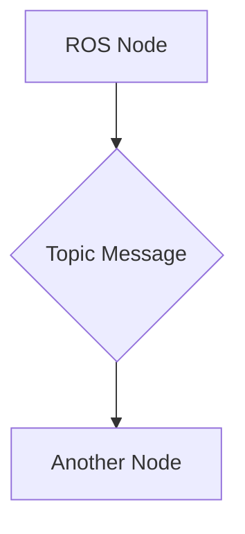

# Quickstart Guide: Physical AI & Humanoid Robotics Textbook

## Prerequisites

Before starting with the Physical AI & Humanoid Robotics textbook project, ensure you have the following installed:

- **Node.js**: Version 18.0 or higher
- **npm**: Version 8.0 or higher (usually comes with Node.js)
- **Git**: Version control system
- **A code editor**: VS Code, WebStorm, or similar
- **GitHub account**: For version control and deployment

## Getting Started

### 1. Clone the Repository

```bash
git clone https://github.com/[your-org]/physical-ai-textbook.git
cd physical-ai-textbook
```

### 2. Install Dependencies

```bash
npm install
```

This will install all necessary dependencies including Docusaurus and its plugins.

### 3. Start Development Server

```bash
npm start
```

This command starts a local development server and opens the textbook in your default browser. Most changes are reflected live without restarting the server.

### 4. Project Structure Overview

```
docusaurus-book/
├── docs/                 # Textbook content organized by modules
│   ├── module-1-ros2/    # Module 1: The Robotic Nervous System
│   ├── module-2-digital-twin/ # Module 2: The Digital Twin
│   ├── module-3-ai-brain/ # Module 3: The AI-Robot Brain
│   └── module-4-vla/     # Module 4: Vision-Language-Action
├── static/               # Static assets (images, videos, etc.)
├── src/                  # Custom React components
├── tutorials/            # Code examples and exercises
├── docusaurus.config.js  # Main configuration file
├── sidebars.js           # Navigation structure
└── package.json          # Project dependencies and scripts
```

## Adding New Content

### Creating a New Page

1. Navigate to the appropriate module directory in `docs/`
2. Create a new markdown file with the `.md` extension
3. Add frontmatter at the top of the file:

```markdown
---
title: Your Page Title
sidebar_position: 1
description: Brief description of the page content
---

# Your Page Title

Your content here...
```

### Adding Code Examples

Use fenced code blocks with appropriate language specification:

```python
# ROS 2 Python example
import rclpy
from rclpy.node import Node

class MinimalPublisher(Node):
    def __init__(self):
        super().__init__('minimal_publisher')
        # Your code here
```

### Adding Exercises

Create exercises in the `tutorials/exercises/` directory with solutions in `tutorials/solutions/`.

## Building the Textbook

To build the static version of the textbook for deployment:

```bash
npm run build
```

The built files will be in the `build/` directory and can be served by any static hosting service.

## Local Development Workflow

1. **Create a feature branch**:
   ```bash
   git checkout -b feature/your-feature-name
   ```

2. **Make your changes** in the appropriate directories

3. **Test your changes** by running `npm start` and viewing in browser

4. **Commit your changes**:
   ```bash
   git add .
   git commit -m "Brief description of changes"
   ```

5. **Push to remote** and create a pull request

## Deployment

The textbook is automatically deployed to GitHub Pages when changes are merged to the `main` branch. The GitHub Actions workflow handles:

- Installing dependencies
- Building the static site
- Deploying to GitHub Pages

## Common Tasks

### Adding Images

1. Place images in the `static/img/` directory
2. Reference them in markdown using absolute paths:
   ```markdown
   
   ```

### Creating Diagrams

Use Mermaid diagrams directly in markdown:



### Adding Custom Components

Create React components in `src/components/` and import them in your markdown files:

```jsx
import MyComponent from '@site/src/components/MyComponent';

<MyComponent />
```

## Troubleshooting

### Server won't start
- Ensure Node.js and npm are properly installed
- Try clearing npm cache: `npm cache clean --force`
- Delete `node_modules/` and reinstall: `rm -rf node_modules && npm install`

### Build fails
- Check for syntax errors in your markdown files
- Ensure all referenced images and assets exist
- Verify that all links are valid

### Content doesn't appear in sidebar
- Check that the file is properly referenced in `sidebars.js`
- Ensure the `sidebar_position` frontmatter is set correctly

## Next Steps

1. Review the [Project Constitution](../../.specify/memory/constitution.md) for content standards
2. Check the [Module Structure](../specs/physical-ai-textbook/plan.md) for detailed organization
3. Follow the [Spec-Kit Plus](../../.specify/templates/spec-template.md) guidelines for content creation